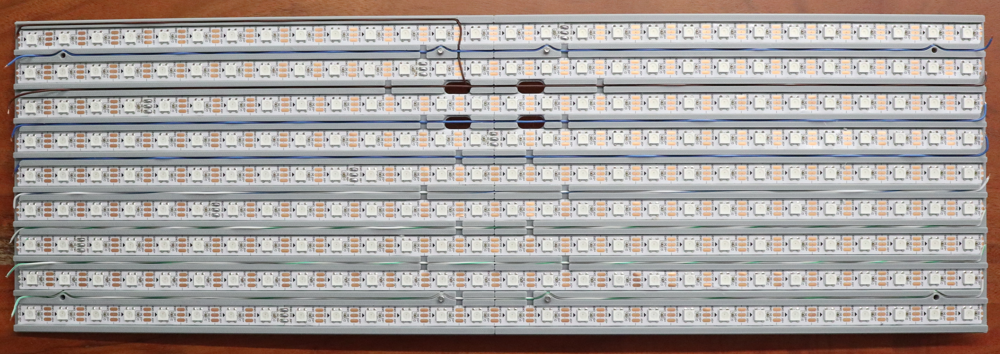

**LED Display Panel**

2D matrix display panel - 3D printed and easy to assemble

### Introduction

This repository contains instruction on how to assemble a 9*28 led display matrix. The display uses WS2812B LED strips (60 led/meters) and an ESP8266 flashed with WLED.

### Bill of material

- 1 wemos D1 mini (any clones work, I took one with USB C) - [2.49€ for on Aliexpress](https://s.click.aliexpress.com/e/_oFv1SbX)
- 4.2 meters of 60 leds / meter WS2812b 5V IP30 strip (252 leds + one led used as signal amplifier) - [8.79€ on Aliexpress](https://s.click.aliexpress.com/e/_oFkeAhT)
- a 5 volts power supply - depending on how bright you want it to become, anything between 1A (5W) and 5A (25W) would do - [3.45€ on Aliexpress for 2A](https://s.click.aliexpress.com/e/_oFSjq2z)
- a DC jack input port - [1.09€ on Aliexpress for 5 pieces](https://s.click.aliexpress.com/e/_om4srWZ)
- a resistor, any value between 200Ω and 500Ω will do - [1.09€ for 100 pieces on Aliexpress](https://s.click.aliexpress.com/e/_oEi3eEl)
- 4 meters of thin wires (max diam. 1mm - 28/30AG) for the signal wire - I used a sacrificial ethernet cable - [2.09€ for 10M 30AWG on Aliexpress](https://s.click.aliexpress.com/e/_omLRoaV)
- 60cm of 18 AWG cable or equivalent (max diam. 2mm) - [3.29€ for 5M 18AWG on Aliexpress](https://s.click.aliexpress.com/e/_omLRoaV)

Optional:
- a capacitor, any above 5 volts and above 450uf will do - it will help the power supply in case of sudden change of consumption - [1.59€ for 20 6.3V 1000uf on Aliexpress](https://s.click.aliexpress.com/e/_okpESW5)
- 3 Wago 221 splicing connectors, 2x3 pin(221-413), 1x2pin (221-412) - you can solder directly to the esp, but this helps with assembly - 1.5€ 

### Assembly

Start by printing the part available on maker world. You will need at least the back connection plate as well as the 2 back panels to start the assembly.

1. Cutting the led strip. 

   Cut the led strip to length, you need 9 strip with each 28 leds. You can use the 2 back panels to quickly measure the led strips.
   

2. Connect the 2 back panel via the connection plate. 

   Use 4 M3*8mm screws to connect the connection plate to the 2 back panels.
   
3. Stick the led strip to the back panels. 

   The data in (marked Din on the strip) side of all the strip need to be on the left, while the data out (marked DO on the strip) side need to be on the right. Most strips also comes with an arrow on them, make sure if points to the right for all the strips.
   

4. Connect the entry data line. 

   You need a thin cable to fit into the data line slots, around 1mm in diameter. I've used a sacriphicial ethernet cable.

   Lay the data line cable in the top left chanel, to start on Din, and go through its dedicated chanel to the connection plate, leave enough cable out the back to later connect the ESP to it (about 10cm extra). 

   Strip 1 mm off of the cable, and solder it to Din.
   
   
5. Connect the other data line.

   Next connect the DO pin of the first line with the Din of the second, using the dedicated chanel on the back panel. Repeat this until all Din of your strips are connected.
   
   
6. Connect the positive and negative of each strip with the strip above and under using some 18AWG wires.
   
7. Next add longer 18AWG wires that will be used to power the strips, those need to be long enough to connect from the strips to the wago holder on the connection plate.
   
8. Add a sacriphisial LED to the wemos D1 mini. 

   In order to control the led strip, a 5V signal is needed. One WS2812b can be used to boost the signal from 3.3V to 5V.

   Cut one LED and stick it to the back of the ESP. Add one resistor (200 to 500Ω) on pin RX (GPIO3). Connect the other end of the resistor to Din on the single LED.

   Connect the 5V of the wemos to the 5V of the single LED, do the same with ground (marked G on the wemos).

9. Connect the wemos to power.

   Connect 2 wires to the 5V and ground pin of the single LED, making sure they are long enough to reach the wago holder on the connection plate.
   

10. Connect the power in jack to the wago connector

    Simply solder a positive and negative wire to the DC jack input port and insert into the corresponding wago connector.

### Programming

1. I used WLED to control the screen, it works out of the box. Follow [the guide at wled](https://kno.wled.ge/basics/getting-started/) to flash the esp with WLED
2. Configured WLED in Settings->LED Preferences
   Start by enabling the automatic brigtness limiter and configure the max power of your power supply
   Configure the LED output with type: WS821x, m/LED: 55mA, Color order: GRB, Start: 0, Lenght: 253, Data GPIO: 3, and finally set Skip first LEDs: 1. Leave the rest to default and save.
   (See full config [here](images/LED_Preferences.png "LED Preferences"))
3. Then go back to Settings, and go in 2D Configuration.
   In Strip or panel select: 2D matrix.
   Cofigure as follow: Number of panels 1, 1st LED: Top Left, Orientation: Horizontal, Dimensions: 28x9, Offset: X:0 Y:0. Save your change.
   (See full config [here](images/2D_Configuration.png "2D Configuration"))
4. You can now use the effect Scrolling text to display text. It display the name of the segment as text, you can use #HHMM as segment name if you want to display the time.
   Adjust the Y Offset in the effect setting to center the text.
5. If something is not as expected, make sure you have the same segment configuration as in this [screenshot](images/Segments.png "Sements confiuration").
